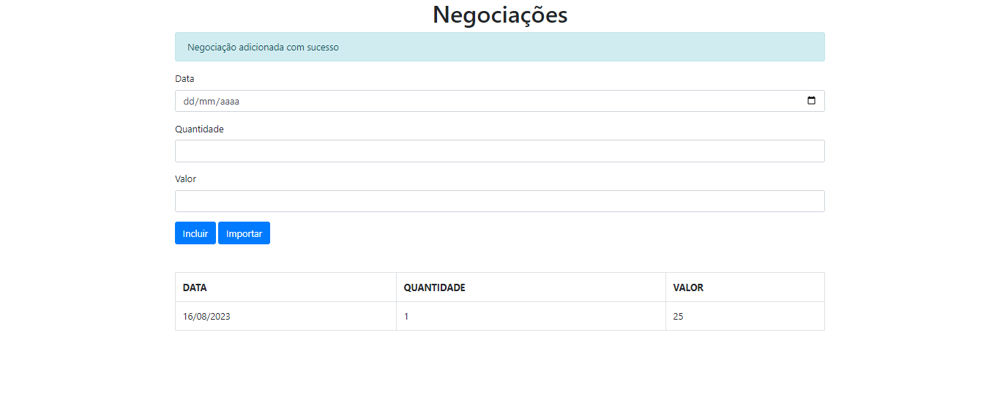

# Projeto referente a aplicação na bolsa de valores 

O projeto é uma aplicação na bolsa de valores construído interiaramente com TypeScript, utilizandos de modules. Ao longo dos 3 cursos realizados para a criação deste projeto, vimos como configurar um ambiente do zero, modificadores de acesso, herança e tipos genéricos, o uso de Decorators, interfaces, consumo de uma API REST, dentre outros conteúdos.  

### Utilizamos as seguintes tecnologias para o seu desenvolvimento:  
• HTML  
• TypeScript  
• Javascript
 

 ### Foto da tela de aplicação
 

 Projeto desenvolvido a partir dos cursos da Alura, com a Trilha <b>Melhore sua experiência de desenvolvimento com TypeScript</b>
